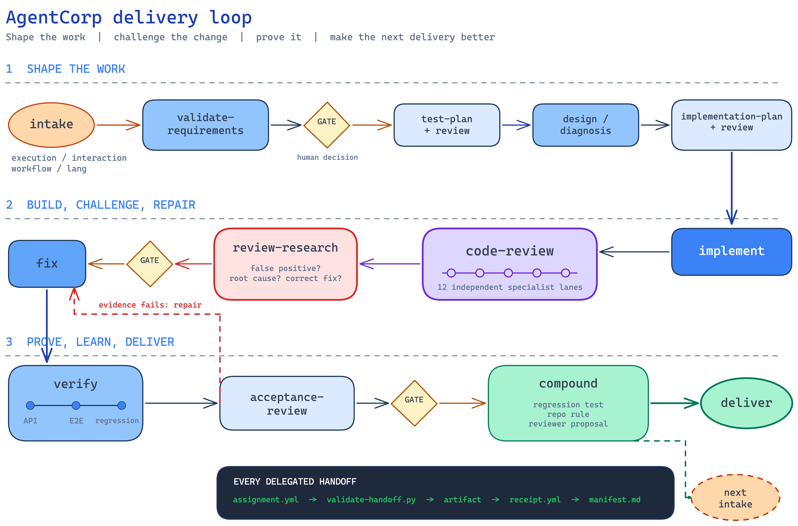

<div align="center">

# AgentCorp

### 把编程 Agent 组织成一支软件交付团队。

**不同角色负责探查、规划、实现、质疑与验证；真正重要的决定回到你手里。**

给 AgentCorp 一个软件任务。它会在 Claude Code 与 Codex 上编排职责明确、相互制衡的角色，
并用人工门禁和可复用上下文串起全过程，最后留下代码、评审结论、验证证据，以及一份你能检查、
能改道的交付记录。

[](#claude-code) [](#codex) [](docs/skills_CN.md)

[English](README.md) · 简体中文

[快速开始](#快速开始) · [为什么选择 AgentCorp](#为什么选择-agentcorp) · [如何运转](#如何运转) · [38 项技能](docs/skills_CN.md)

</div>

## 快速开始

### Claude Code

```text
/plugin marketplace add ylxmf2005/AgentCorp
/plugin install agentcorp@agentcorp
```

运行 `/reload-plugins` 或重启 Claude Code。

### Codex

```text
codex plugin marketplace add ylxmf2005/AgentCorp
codex plugin add agentcorp@agentcorp
```

新建一个 Codex task 即可开始。添加 marketplace 后，也可以从 `/plugins` 菜单安装
**AgentCorp**。生命周期 hook 还需要一步设置，详见 [Codex 配置说明](docs/codex-setup_CN.md)。

### 交给它一个任务

直接把工作交给对应技能。端到端任务由 Delivery Orchestrator 自己判断工作流参数；
单独评审时，由 Code Review Lead 根据 diff 和风险自己判断深度：

```text
/agentcorp:delivery-orchestrator <your prompt>
/agentcorp:code-review-lead <your prompt>
```

只有在你需要明确控制时才要写参数；默认让技能根据任务、仓库与风险面自行判断。

## 为什么选择 AgentCorp

编程 Agent 写代码很快，难的是判断它的结果是否真的值得交付。一次普通对话往往把作者、
评审者和测试者折叠进同一个上下文，自信的结论很容易被当成证据。

AgentCorp 拆开这些职责，并让交接过程可以检查：

| 常见的 Agent 工作方式 | AgentCorp |
| --- | --- |
| Agent 写完改动，再评价自己的工作 | 工作流把作者与批准者分开 |
| 人只在最后看到一份答案 | 发起人参与塑造意图、可在已记录门禁改道，并保留范围与残余风险的决定权 |
| 一条评审发现直接变成修复 | 工作流要求 `review-researcher` 先把它当作可能的误报重新证实 |
| 「测试通过」就是故事的结尾 | 每个结论都指向可打开的路径、日志、响应或截图 |
| 空值检查与系统迁移走同一套流程 | mode 与 effort 按风险伸缩整个组织 |
| 会话结束，教训也随之消失 | `compound` 把教训变成测试、仓库规则或 reviewer 提案 |

AgentCorp 不是新的 coding model、Agent runtime 或提示词合集，而是一套带契约的交付组织：
谁产出每份材料、谁有权批准，以及工作继续推进前必须先存在哪些证据。

## 最终会留下什么

经过编排的任务按设计会留下可导航的记录。完整布局把跨任务知识与每项任务的决策、
证据放在一起：

```text
teamspace/
├── testing-context.md                   # 跨任务运行与测试事实
├── compound/                            # 历史任务沉淀的可复用经验
│   └── <lesson>.md
├── knowledge/                           # 可复用研究快照
│   └── <technology>/INDEX.md
├── probes/                              # 独立的领域探查报告
│   └── <date>-<topic>.md
├── walkthroughs/                        # 独立的教学产物
│   └── <change>.html
└── tasks/<task>/
    ├── task.md                          # 成功标准、路径、决策和门禁历史
    ├── manifest.md                      # 阶段、owner、质量门、产物、receipt
    ├── probe/
    │   └── 00-probe.md                  # 未知项与被纠正的假设
    ├── handoffs/                        # 委派任务与回执
    │   ├── <phase>.md
    │   └── <phase>-receipt.md
    ├── requirements/
    │   └── validated-requirements.md
    ├── design/
    │   ├── architecture.md
    │   ├── impact-analysis.md
    │   ├── diagnosis.md
    │   └── interface-contract.md
    ├── test/
    │   ├── test-plan.md
    │   ├── api-test-plan.md
    │   ├── e2e-test-plan.md
    │   ├── regression-test-plan.md
    │   ├── test-plan-review.md
    │   └── exploration/
    │       ├── charters.md
    │       ├── frontier.md
    │       └── journal.md
    ├── implementation/
    │   ├── implementation-story.md
    │   └── implementation-result.md
    ├── review/
    │   ├── plan-review.md
    │   ├── plan-review-findings/
    │   ├── code-review.md
    │   ├── specialist-findings/
    │   │   └── <reviewer>.md
    │   ├── research/
    │   │   ├── 00-index.md              # 每条发现都会被重新核实
    │   │   ├── 001-confirmed-....md
    │   │   └── 002-false-positive-....md
    │   ├── fix-records/
    │   │   └── <file-group>.md
    │   └── fix-result.md
    ├── research/<topic>/                # 需要动手验证的研究包
    │   ├── 00-report.md
    │   ├── env/
    │   ├── sources/
    │   └── experiments/
    ├── explain/                         # 持久化的决策解释
    │   └── <topic>/
    │       ├── 00-index.md
    │       └── 001-context.md
    ├── walkthrough/
    │   └── <change>.html                # 背景、直觉、故事、测验
    ├── verification/
    │   ├── assignments/
    │   │   └── <tester>.md
    │   ├── test-results/
    │   │   └── <tester>.md
    │   └── verification-report.md
    ├── acceptance/
    │   ├── acceptance-package.md
    │   └── acceptance-decision.md
    ├── compound/
    │   └── compound-result.md
    └── delivery/
        └── delivery-report.md
```

不是每项任务都会创建所有可选文件，但每个实际运行的阶段都有明确归属。阶段产物带结构化
frontmatter；委派交接的声明在进入审计记录前先经过机械校验。完整结构见
[运行时产物说明](docs/artifacts_CN.md)。

## 如何运转

[](docs/assets/delivery-workflow.excalidraw)

AgentCorp 不会把你的 prompt 直接丢给一个 coding agent。Delivery Orchestrator 会按任务
与风险选择工作路线、分配 owner，并在 `task.md` 与 `manifest.md` 中记录代码基线、
阶段产物和人工门禁。`interaction:auto` 会在必须由人决定的位置之间继续推进已就绪、
可逆的工作；`interaction:gate` 则会在每道人工门禁停下。

1. **和你一起把任务定义清楚。** 编排器会在实现前记录成功标准与非目标。遇到陌生领域时，
   `probe` 会调查代码、测试、配置、历史和过往经验，再带回一份领域报告与未知项台账。
   方向不清晰时，`brainstorm` 会提供完整的候选路径；只有你选中的方向才会成为需求。
   已经存在的方案还可以用 `grill` 现场压测。
2. **写代码前，先设计怎样证明它。** Test Planner 把风险写成可直接执行的 API、E2E 和回归测试手册。
   Solution Architect 按任务需要产出故障诊断、影响分析、架构或接口契约。独立 reviewer 会在
   工程师开始实现前，判断测试计划和 Implementation Story 是否真的已经就绪。
3. **每个角色都拿到明确契约，也有不同的批准者。** 被委派的角色会收到一份 assignment，列明来源文件、
   代码基线、可编辑边界与输出路径；完成后返回 receipt，AgentCorp 再根据实际落盘产物进行检查。
   Implementation Engineer 不能批准自己的工作；Code Review Lead 只会根据实际风险召集必要的
   专项 reviewer。
4. **评审发现经过重新研究，才能进入修复。** 被路由处理的 finding 进入 `review/research/` 时只是一个
   待证假设，而不是事实。Review Researcher 会独立追踪它，并记录 `confirmed`、`false-positive`、
   `partial` 或 `needs-human`，以及它应当现在修复还是延后。Review Fixer 只会收到经过验证、
   并已决定在本任务落地的项目。
5. **按最初的意图证明这次交付。** Test Leader 分派 API、E2E、回归和风险专项 tester，打开它们的日志、
   响应、截图或命令输出后，才能给出验证结论。Acceptance Review Lead 再独立把这些证据对应回
   每条 Must Have，并报告任何尚未验证的行为或残余风险。

人的参与不是最后点一下批准。在已记录的人工门禁，你可以修改需求或设计，把 finding 从 `fix-now`
改为 `defer`，要求补充证据，或接受一项已明示的残余风险。如果你尚不具备做决定所需的理解，
`explain` 或 `walkthrough` 会先补回缺失的上下文，再重新发起门禁。交付后，`compound` 会把值得保留的经验
变成测试、仓库规则，或必须经人批准才能落地的组织改进提案。

## 按风险调节流程

四个相互独立的旋钮控制一次交付：

| 旋钮 | 取值 | 控制什么 |
| --- | --- | --- |
| `mode:` | `direct` \| `partial` \| `full` | 谁执行各阶段、谁负责评审 |
| `interaction:` | `auto` \| `gate` | 跳过可选人工暂停，或在每道人工门禁停下 |
| `effort:` | `low` \| `medium` \| `high` \| `max` | 召集多少独立覆盖与冗余 |
| `lang:` | 任意语言 | 所有面向人的产物使用什么语言 |

低 effort 用冗余换速度，但绝不拿证据换方便。遇到安全、权限、公开契约和数据丢失风险时，
工作流要求相关阶段接受更深的审查。每一档和每个技能的准确行为见[参数目录](docs/parameters_CN.md)。

## 文档

- [全部 38 项技能](docs/skills_CN.md)
- [参数与 effort 档位](docs/parameters_CN.md)
- [运行时产物](docs/artifacts_CN.md)
- [Codex 配置](docs/codex-setup_CN.md)

问题与缺陷请提交到 [GitHub Issues](https://github.com/ylxmf2005/AgentCorp/issues)。
