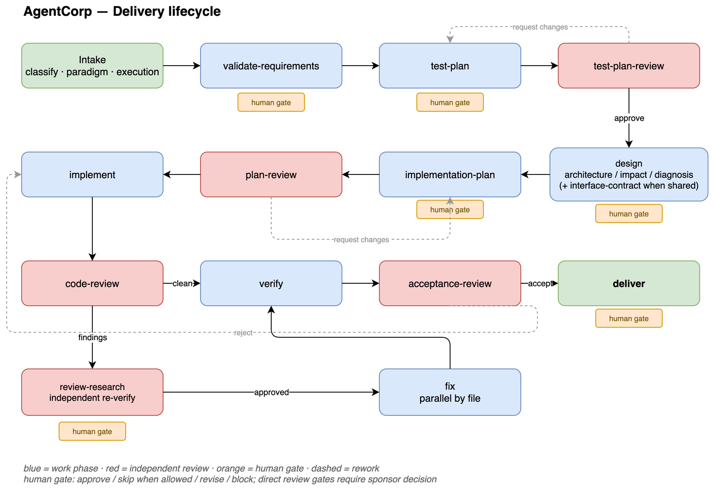
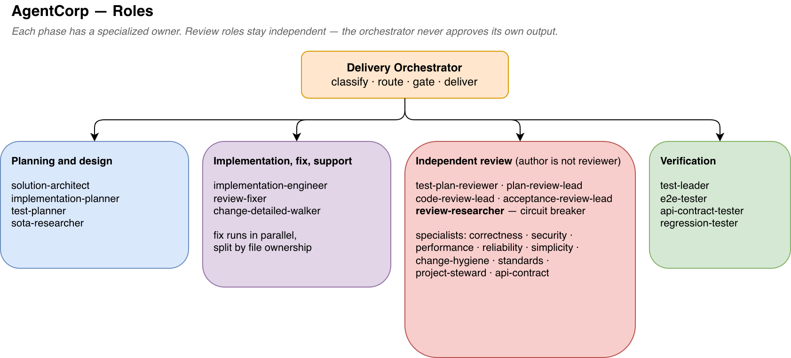

# AgentCorp

[English](README.md) | **中文**

AgentCorp 是一套以 **Agent Skills** 形式打包的多 agent 软件交付流水线。一个 Delivery
Orchestrator(交付编排者)对任务分类,并把每个 phase 路由给专门的角色——规划、实现、
多个**独立**的代码评审、以及分层验证——phase 之间设有明确的 gate。

整套 skill 采用 [Agent Skills](https://agentskills.io) 的 `SKILL.md` 标准,因此同一份
skill 可以从这一个仓库同时安装到 **Claude Code** 和 **Codex**。

## 工作流

AgentCorp 建模的是一个交付*组织*,而不是单条 prompt。Delivery Orchestrator 把每个任务
分到四种范式之一——`dev/architecture-first`、`enhancement/delta-design`、
`bugfix/hypothesis-driven`、`addition/simple`——再按分阶段的生命周期推进,其中**产物的
作者绝不审批自己的产物**。

### 1. 交付生命周期

每种范式都跑同一组 phase 的一个子集。评审 phase(红色)和人工 gate(黄色)夹在工作
phase 之间;`要求修改` / `驳回` 会回退。



### 2. 角色

每个 phase 由专门的 skill 负责。评审角色与它评判的工作保持独立;编排者不审批自己的产出。



### 3. review → research → fix 主脊

AgentCorp 的招牌:code-review 的 findings 绝不盲目修。一个独立的 `review-researcher`
先逐条复核每个 finding——一个掐掉误报的断路器——确认后才落地修复。修复再按文件归属并行
切分,两个 worker 不会碰同一个文件。


### 4. Handoff 与 gate

被委派的 phase 通过 assignment/receipt 文件流转。每份 receipt 先做*机械校验*(产物是否
存在、路径 / author / phase 是否对得上),通过后才按该 phase 的*质量 gate* 判断——两者分开。


### Workflow modes

| Mode | 默认 | 如何运作 | 何时 |
|------|------|---------|------|
| `single-agent` | 是 | 编排者亲自跑非 review phase;review 仍委派 | 常规 / 中小任务 |
| `subagents` | 否 | 每个 phase 都经 assignment/receipt 委派给 owner | 大型或可并行的工作,或需要独立 authorship 时 |

## 一次运行会产出什么

每个 phase 都会把一份带 YAML frontmatter 的 Markdown 产物写到固定路径,所以一个跑完的
任务本身就是一条**自带文档的证据链**,而不是一段聊天记录。被委派的 phase 以
**assignment → receipt** 成对流转;每份 receipt 先过*机械校验*(`validate-handoff.py`
——产物是否存在、路径 / author / phase 是否对得上)再过质量 gate,一份 `manifest.md`
账本记录每个 phase、owner、gate 结果和产物路径。

所有产物都在工作目录的 `teamspace/` 下——这是**本地协调状态,绝不提交**(若出现在 git
status 就加进 `.git/info/exclude`)。只创建任务真正需要的子目录。

```text
teamspace/tasks/<task_id>/
├── task.md                       # 目标、任务分类、gate 历史
├── manifest.md                   # 账本:phase · owner · gate · 产物路径
├── handoffs/                     # assignment + receipt 成对(委派的 phase)
│   ├── 001-validate-requirements.md
│   └── 001-validate-requirements-receipt.md
├── requirements/
│   └── validated-requirements.md
├── test/
│   ├── test-plan.md
│   └── test-plan-review.md
├── design/                       # 按范式四选一
│   └── architecture.md | impact-analysis.md | diagnosis.md | api-contract.md
├── implementation/
│   ├── implementation-story.md
│   └── implementation-result.md
├── review/
│   ├── plan-review.md
│   ├── code-review.md
│   ├── specialist-findings/
│   ├── research/                 # review-researcher:逐条 finding 一文件 + 索引
│   │   ├── 00-index.md
│   │   └── <编号>-<slug>.md
│   ├── fix-result.md
│   └── fix-records/              # 每个并行 review-fixer 组一份
├── verification/
│   ├── assignments/
│   ├── test-results/
│   └── verification-report.md
├── acceptance/
│   ├── acceptance-package.md
│   └── acceptance-decision.md
└── delivery/
    └── delivery-report.md
```

## 安装 — Claude Code

```
/plugin marketplace add ylxmf2005/AgentCorp
/plugin install agentcorp@agentcorp
```

然后 `/reload-plugins`(或重启 Claude Code)。skill 在插件下带命名空间,例如
`/agentcorp:delivery-orchestrator`、`/agentcorp:code-review-lead`。

## 安装 — Codex

**整套(插件):**

```
codex plugin marketplace add ylxmf2005/AgentCorp
```

然后启动 Codex,在 `/plugins` 菜单里启用 **AgentCorp**,重启以加载 skill。

**单个 skill(更轻,不走插件):** 在 Codex 里让内置 installer 装,例如

```
use skill-installer to install the skill at repo ylxmf2005/AgentCorp path agentcorp/delivery-orchestrator
```

这会把 skill 装到 `~/.codex/skills/`。

## 包含哪些 skill

覆盖完整流水线的 26 个 skill:

- **编排** — `delivery-orchestrator`
- **规划与设计** — `solution-architect`、`implementation-planner`、`test-planner`、`sota-researcher`
- **实现** — `implementation-engineer`、`review-fixer`
- **计划 / 测试计划评审** — `plan-review-lead`、`test-plan-reviewer`、`adversarial-reviewer`
- **代码评审** — `code-review-lead`,以及专项 reviewer:`correctness-reviewer`、`security-reviewer`、`performance-reviewer`、`reliability-reviewer`、`simplicity-reviewer`、`standards-reviewer`、`api-contract-reviewer`
- **验证** — `test-leader`、`e2e-tester`、`api-contract-tester`、`regression-tester`
- **评审研究与验收** — `review-researcher`、`acceptance-review-lead`
- **支撑** — `change-detailed-walker`、`fresh-start-handoff`

每个 skill 的完整描述见各自的 `agentcorp/<skill>/SKILL.md`,也会显示在 Claude Code /
Codex 的 skill 选择器里。

## 目录结构与维护

| 路径 | 作用 |
|------|------|
| `agentcorp/<skill>/SKILL.md` | skill 本体——**单一源**,两个工具共用 |
| `.claude-plugin/plugin.json`、`.claude-plugin/marketplace.json` | Claude Code 清单——**canonical 元数据** |
| `.codex-plugin/plugin.json`、`.agents/plugins/marketplace.json` | Codex 清单——**自动生成** |
| `tools/codex-interface.json` | Codex 专属品牌/policy(Claude 无对应) |
| `tools/sync-codex.py` | 从 Claude 清单重新生成 Codex 清单 |

两个生态都把各自的 `skills` 字段指向同一个 `./agentcorp` 目录并自动发现 skill 文件夹——
没有重复的 skill 内容。要改元数据:编辑 Claude 清单(以及 Codex 品牌用的
`tools/codex-interface.json`),然后运行:

```
python3 tools/sync-codex.py
```
