# AgentCorp

**面向软件交付的 Loop Engineering:可控、可理解、可验证。**

[English](README.md) · 简体中文

[快速上手](#快速上手) · [一次交付如何运转](#一次交付如何运转) · [信任架构](#信任架构) · [技能一览](#技能一览) · [产物一览](#产物一览) · [诚实的局限](#诚实的局限)

---

AI 生成代码的速度每个月都在变快，但验证代码是否正确的成本，始终在你身上。比代码更棘手的是随之而来的恶性循环:Agent 的工作过程如同黑箱，你无法跟上它的推理；跟不上，就只能跳过 review;跳过 review,认知债务便会累积；债务越深，你越离不开它——最终，重要的任务你不敢交给它。

AgentCorp 是为打破这个循环而生的 [Loop Engineering](https://addyosmani.com/blog/loop-engineering/) 系统。它把一整套软件交付组织——**37 项技能**：编排者、规划者、工程师、12 条专项评审车道、测试者、验收关卡，以及围绕它们的思考/教学能力——打包成纯 markdown 的 Agent Skills,同时运行在 **Claude Code** 与 **Codex** 上(同一份 skill 本体，开放的 Agent Skills 标准)。与其说是提示词合集，不如说是一张带契约的组织架构图——谁产出什么、谁有权放行、工作向前推进之前必须存在什么证据。

- **可控**——流程按任务规模自动裁剪：一行改动走微任务车道(不摆范式的排场——快速路径，评审保留),从零搭建则一个关键环节都不少；关卡真正拦截，重复失败会强制重新规划，而不是第三次原样重试。
- **可理解**——每个阶段都留下结构化产物，记录「谁在什么证据下做了什么决策」；每个评审发现都解释到「即使你没读过这段代码，也能判断该不该改」。
- **可验证**——没有任何角色能为自己的产出放行；测试在写代码之前就已确定；每个评审发现在独立角色亲自走通失败路径之前，都被当作可能的误报。

## 快速上手

### 安装

**Claude Code：**

```
/plugin marketplace add ylxmf2005/AgentCorp
/plugin install agentcorp@agentcorp
```

随后 `/reload-plugins`（或重启）。技能带命名空间，例如 `/agentcorp:delivery-orchestrator`。

**Codex：**

```
codex plugin marketplace add ylxmf2005/AgentCorp
```

启动 Codex，在 `/plugins` 菜单启用 **AgentCorp** 并重启。单独安装某个技能：`use skill-installer to install the skill at repo ylxmf2005/AgentCorp path agentcorp/delivery-orchestrator`。

Codex 没有 `SessionEnd` 事件，插件的生命周期 hook 在 Codex 侧挂载方式不同：把 `hooks/codex-hooks.json` 拷贝或合并进 `<repo>/.codex/hooks.json`(或 `~/.codex/hooks.json`),并把 `AGENTCORP_PLUGIN_ROOT` 改成本仓库路径。两个运行时共用同一批脚本；在 Codex 上,skill-evolution 的 capture 通过 `Stop` hook 逐 turn 记录状态，下次会话启动时把闲置 30 分钟以上的会话扫进分析器。

### 调用技能

主入口是交付编排器（Delivery Orchestrator）。把任务交给它，它会带着任务走完整条流水线——
分类、把每个阶段路由给对应角色、按证据卡关：

```
/agentcorp:delivery-orchestrator 给公开 API 加限流，并在压测下验证
```

只需要其中某一步时，也可以直接调用单个技能：

```
/agentcorp:code-review-lead 合并前对当前 diff 做一次代码评审
```

### 第一次使用

安装完成后，直接描述你的需求，或调用 `/agentcorp:delivery-orchestrator`。它会先与你确认成功标准、推荐执行路线，然后按阶段推进，在每个关卡停下汇报。

需要真实浏览器或登录态验证时，它会使用独立的浏览器 Profile打开页面，请你手动登录一次，之后在页面内自动执行检查——不会触碰你的本地 Cookie。任务结束后，你将获得一份交付报告，以及一份可回溯每个决策的审计记录。

## 一次交付如何运转

```mermaid
flowchart LR
    A[intake] --> B[validate-requirements]
    B -.人工门禁.-> C[test-plan + review]
    C --> D[design / diagnosis]
    D --> E[implementation-plan + review]
    E --> F[implement]
    F --> G[code-review<br/>12 条专项车道]
    G --> H[review-research<br/>熔断器]
    H -.人工门禁.-> I[fix]
    I --> J[verify<br/>API / E2E / 回归]
    J --> K[acceptance-review]
    K -.人工门禁.-> L[compound 沉淀]
    L --> M[deliver]
```



把任务交给 Delivery Orchestrator,它会替 sponsor(这条流水线对之负责的人——也就是你)先分类工作、选定范式(从零搭建/增强/修缺陷/简单新增)、把阶段序列作为承诺宣布出来，然后驱动整条流水线——在每个人工门禁停下，给你一份可导航的摘要(*进行到哪 → 我看到什么 → 我的建议 → 你的选项*),而不是一句干巴巴的「批不批?」。阶段之间靠**带 YAML 契约的 assignment/receipt 文件**流转，并被机械校验:receipt 声称的 artifact 不存在、交付物是空壳、没人认识的 phase 名——`validate-handoff.py` 在任何人读到一个字之前就拦下。

四个正交旋钮按任务调节协作方式，每一个都注入下游每份 assignment:

| 旋钮 | 取值 | 决定 |
| --- | --- | --- |
| `mode:` | `direct` \| `partial` \| `full` | 你亲自当评审 / 编排者执行、评审委派 / 每个阶段都委派 |
| `cadence:` | `continuous` \| `guided` | 持续推进、到检查点汇报 / 一次一个产物、边做边教 |
| `rigor:` | `light` \| `balanced` \| `standard` \| `strict` | 这单任务买多少冗余和可选覆盖 |
| `lang:` | 任意 | 所有人读产物用什么语言写 |

`rigor:light` 用**冗余**换速度——一轮评审、聚焦验证、可选阶段跳过。它从不拿诚实做交换：任何档位都*无权*伪造证据、自批自审或跳过原始失败输入的重跑——artifact 契约的存在就是为了让违规可见——而安全/权限/数据丢失面会**自动把相关环节升到 strict 并明说**，无论任务选了什么档。单个技能同样接受参数：`/agentcorp:probe output:inline`、`/agentcorp:walkthrough format:md quiz:off`、`/agentcorp:explain reader:newcomer`。

对账单要诚实：多评审委派的流水线消耗真实的 token 和时钟，而这正是 `rigor` 定价的东西——`light` 接近单 agent 会话，`strict` 为每条车道买一个独立会话。把钱花在错误代价高的地方。

## 信任架构

下面每条机制，都是因为它的朴素版本在真实场景里翻过车：

- **没有角色能为自己的产出放行。**作者/评审分离在每种模式下都成立——即使单人 `direct` 模式，评审关卡也保留，由知情且明确愿意的*你*来当评审。
- **评审发现是假设，不是事实。**多 agent 协作里最贵的失败，是一条自信但错误的发现被下游当成真理。`review-researcher` 是熔断器：以「误报」为零假设对每条发现对抗性重查，用点名的证据杀掉假问题——只有被证实且在本单范围内的项才进 `fix`。
- **结论必须有据可开。**「测试通过」只有配上你能打开的东西——路径、日志、渲染截图——才算数。只能在本机没有的环境里验证的行为标记 `unverified` 且不过任何门；口头确认不是证据；原始证据日志只增不删。
- **人工门禁只说封闭词表。**人工门禁只落 `approved / skipped / revised / blocked` 四种结果——有记录，绝不静默通过。sponsor 的回复没有回答问题就映射为*无结果*：流水线里没有任何环节可以发明「默认批准约定」。
- **高危改动要过跨模型家族第二意见。**碰到安全边界、公共契约、不可逆发布,verdict 归属者在下结论前，从*另一个*模型家族取一份独立冷读(Codex 查 Claude 家族的活，反之亦然)——两个家族更不容易共享同一个盲区。
- **机械层本身被 fuzz 测过。**`validate-handoff.py` 的已知盲区靠 fuzz 找出，并由随仓发布的回归套件(`tools/test-validate-handoff.py`)钉死，保证不复发。

## 它会自我进化——但有人工门禁

AgentCorp 把自己的技能也当作被测系统：

- **捕获 → 呈现 → 落地。**会话结束的 hook 分析轨迹里的技能改进信号(持久化之前先隐私脱敏),下次会话呈现待审数量，`skill-evolution` 起草编辑——只有对具体 diff 的一句明确同意才落地。没有任何东西静默自改。
- **`compound`(沉淀)是一个 phase,不是一条笔记。**交付之前，本轮的教训变成自己会生效的资产：修过的 bug 变成回归测试，踩过的坑变成 `CLAUDE.md` 规则，被证实的评审模式变成给漏掉它的 reviewer 的提案。
- **`retrospect` 回放会话本身。**确定性提取器把 runtime 自己的记录(Claude Code 项目 JSONL、Codex rollouts)解析成 turns、时钟、token 开销、工具错误和卡壳点——分析的每个论断锚定到轨迹条目。记忆只是假设，轨迹文件才是证据。
- **改动需要失败轨迹。**演化守则拒绝纯措辞润色：一次技能修改必须引用一条具体的失败运行、断在哪道门、错在触发词、正文规则还是跨技能契约。

## 用陷阱场景做回归实测——测试随仓发布

`scenarios/` 里是用来演化它的**黄金回归集**：九个埋了陷阱的交付任务——取材于 SWE-bench、TAU-bench、RefactorBench 上真实的 agent 失败模式——由真实技能端到端跑完，每个 phase 由只拿到契约输入的隔离 agent 执行。陷阱包括：一个自信地指错修复位置的 issue、一套改断言就是最省力绿灯的测试、一条藏在文档里而目标状态恰好靠违反它达成的政策、一个只有真实浏览器才能验证的缺陷。配套还有 24 条路由探针(真实措辞 vs 触发表)和 validator 的 fuzz 套件。任何技能修改都要重放它的目标场景和关联技能——校准对(必须走轻的一行改动、必须走重的从零搭建)保证流水线永远不会被单向优化。

## 技能一览

37 项技能按交付阶段分组如下（同一阶段里，规划者、评审者、实现者放在一起）。每个技能的具体行为定义在 `agentcorp/<skill>/SKILL.md` 中，也会出现在 Claude Code 和 Codex 的技能选择器里。它们共同覆盖交付循环，以及真实项目里运行这套循环所需的配套行为。

- **编排**
  - `delivery-orchestrator` — 掌控整条交付流水线：给任务分级、把每个阶段派给对应角色、判断证据是否足以推进到下一关
- **规划与设计**
  - `solution-architect` — 动手写代码前敲定结构性决策，按住变更放大、认知负担和未知的未知带来的复杂度
  - `implementation-planner` — 把定稿的设计切成有序、环环相扣、可独立验证的实现故事，工程师拿到即可开工
  - `plan-review-lead` — 判断实现故事规范是否成熟到工程师能直接开工，不必自己补缺失的架构、范围或未批准的依赖
  - `test-planner` — 在实现之前就定好验证策略：测什么、为什么测，覆盖面跟着风险走而非平均铺开
  - `test-plan-reviewer` — 在实现启动前，判断测试计划的覆盖面是否对得上需求与风险
  - `parallel-researcher` — 把问题拆成多条独立调研线并行求证，确认外部、内部和本地代码里到底有哪些证据，对抗锚定与确认偏误
- **实现**
  - `implementation-engineer` — 把批准的故事规范实现成干净、能跑的代码，贴合项目现有的架构、模式与约定
- **代码评审**
  - `code-review-lead` — 协调各专项评审、汇总他们的发现，按证据而非人数把「过不过」一锤定音
  - `correctness-reviewer` — 专盯功能性缺陷：边界错误、状态写坏、空值蔓延、竞态，这些会让代码在真实输入下给出错误结果
  - `security-reviewer` — 从攻击者视角排查能击穿信任边界的漏洞：注入、越权、硬编码密钥、SSRF
  - `performance-reviewer` — 抓会在规模上拖慢系统或耗尽资源的性能退化：N+1 查询、无界增长、缺分页、阻塞 I/O
  - `reliability-reviewer` — 找依赖出故障时让系统崩溃或卡死的隐患：缺超时、吞错误、重试风暴、资源泄漏、级联故障
  - `adversarial-reviewer` — 先假设它已经坏了再去证明，专攻组合、时序、滥用引发的、单轴评审各自都看不到的涌现型故障
  - `simplicity-reviewer` — 挖出不值当的复杂度：多余的抽象、过早泛化、死代码，以及配不上其成本的结构选择
  - `taste-reviewer` — 判断改动是否长成了对的形态——hack 还是治本形态、错误抽象、概念性错误命名、API 手感、比例失衡——顶着管线偏向最小 diff 的惯性
  - `change-hygiene-reviewer` — 核查 diff 里每处改动是否都能追溯到批准的需求，挡掉越界改动、历史残留和格式噪音
  - `standards-reviewer` — 核对代码与产物是否遵循项目自己的约定：frontmatter、命名、格式、引用方式，而非通用最佳实践
  - `comment-optimizer` — 直接优化注释：重写、删除或补充简短的 why/边界/历史说明，避免先 review 再修的绕路
  - `project-steward-reviewer` — 从长期维护成本、模块边界、对外承诺和项目走向，判断一处变更值不值得写进项目历史
  - `api-contract-reviewer` — 守住 API 边界：schema、路由、类型、状态码、错误语义保持向后兼容，不在无迁移路径下悄悄弄坏调用方
  - `review-researcher` — 独立查证每条评审发现的真伪与根因，作为落地修复前的熔断器，再给出正确利落的修法
  - `review-fixer` — 在授权的文件范围内，按复核给出的修法从根上落地一组已验证的修复，并补上回归检查
- **验证**
  - `test-leader` — 统筹一次变更的整体验证，派出各专项测试者，把证据汇成一个判断，守住交付前那道验证关
  - `e2e-tester` — 以真实用户的身份从外部把系统端到端跑一遍完整流程，如实记录到底发生了什么
  - `api-contract-tester` — 动手写测试并真跑，验证 API 是否兑现其结构、状态码、权限边界和错误语义
  - `regression-tester` — 确认变更之后原本好用的行为仍然好用，逮住那些悄无声息坏掉的回归
- **验收与交付**
  - `acceptance-review-lead` — 守交付前最后一关，判断完整证据是否足以证明所有需求达成、风险可接受
- **配套**
  - `probe` — 在开工前先侦查陌生地带，把地形讲给发起人：修正其原有认知地图、指出意外发现、说明本地「好」长什么样，并维护一份持续更新的未知项台账
  - `brainstorm` — 用一次一问的追问把模糊诉求逼成经发起人确认、可测试的需求
  - `grill` — 对已有的 plan/设计/论证做一次一问的连环拷问,owner 现场答辩，以诚实的就绪判定(`ready`/`needs-evidence`/`needs-redesign`/`blocked`)收束
  - `retrospect` — 用确定性提取器回放 session 的真实轨迹(Claude Code JSONL / Codex rollouts):时间和 token 花在哪、一直在哪失败、该改进什么——发现分别路由到 skill-evolution 提案、项目文档或 compound 条目
  - `authenticated-browser-session` — 用独立浏览器配置维持真实登录态来验证需登录的流程，不读 Cookie 也不要用户贴 token
  - `explain` — 按读者水平讲解 bug、测试进展、评审发现和交付状态——默认面向零上下文的发起人——每个结论都带状态标签和证据
  - `walkthrough` — 把一次变更做成教学产物——先讲背景、代码之前先给直觉、把变更讲成 story 而非文件清单——最后以一份发起人必须通过才能合并的测验收尾
  - `precommit-setup` — 给仓库配提交前防线：默认跑快速确定性检查，AI 评审按需开启，不拖慢每次提交
  - `skill-evolution` — 把在会话结束时捕获的技能改进信号，变成一次经审、落地的编辑（或从调研生成新的 skill），让 AgentCorp 自身的技能在人工参与的控制下持续改进

## 产物一览

每个阶段都会留下结构清晰的产物，全部带 frontmatter（`artifact_type` / `author_agent` / `phase` / `status` / `source_artifacts`），可审计、可回溯。不是每个任务都会生成下面每一个文件；这里展示的是完整运行时布局，AgentCorp 会按任务实际需要创建对应阶段、评审、测试、研究包和交接记录。

```
teamspace/
├── testing-context.md                    # 跨任务运行时事实：入口、登录、页面、可观测面、测试数据约定
├── compound/                             # 跨任务沉淀库：每条一文件、写前去重，含试过不行的路(failed-approach)
│   └── invite-token-reuse-trap.md        #   触发情境 -> 根因 -> 怎么做 -> 下次如何更快
├── knowledge/                            # 可复用研究快照：从任务研究中筛选出值得跨任务保留的材料
│   └── <technology>/INDEX.md
├── probes/                               # 独立地形报告：在任何任务存在之前写下
│   └── 20260620-billing-module.md
├── walkthroughs/                         # 任务之外的独立变更 walkthrough（自包含 HTML）
└── tasks/20260622-invite-members/        # 本次任务根目录
    ├── task.md                           # 任务记录：请求、成功标准、阶段序列、门禁历史、决策日志
    ├── manifest.md                       # 审计台账：阶段、Owner、状态、人工门、质量门、分派单、产物、回执
    │
    ├── probe/                            # 可选：进入需求前的地形报告，附持续更新的未知项台账
    │   └── 00-probe.md
    │
    ├── handoffs/                         # 委派阶段的分派单/回执闭环
    │   ├── 001-validate-requirements.md
    │   ├── 001-validate-requirements-receipt.md
    │   ├── 002-test-plan.md
    │   ├── 002-test-plan-receipt.md
    │   └── ...
    │
    ├── requirements/
    │   └── validated-requirements.md     # 意图、用户、旅程、FR/AC、非目标、约束、假设、开放问题
    │
    ├── design/                           # 按需生成；多个设计产物可以并存
    │   ├── architecture.md               # 新系统/子系统架构：组件、数据/状态流、接口、取舍
    │   ├── impact-analysis.md            # 增量设计：受影响模块、当前/目标行为、风险、需保留行为
    │   ├── diagnosis.md                  # Bug 诊断：复现、假设、根因、建议修复、回归标准
    │   └── interface-contract.md         # 公共/共享契约：schema、认证、错误、兼容性、验证钩子
    │
    ├── test/
    │   ├── test-plan.md                  # 风险排序的总策略、必测层级、显式缺口、禁区
    │   ├── api-test-plan.md              # API/集成手册：字面请求、预期响应、证据处理
    │   ├── e2e-test-plan.md              # E2E 手册：浏览器步骤、字面输入、截图/URL 证据
    │   ├── regression-test-plan.md       # 回归手册：爆炸半径、既有套件、修前失败/修后通过检查
    │   ├── test-plan-review.md           # 测试计划独立评审：approve / request_changes / needs_more_evidence
    │   └── exploration/                  # 补全 testing-context.md 的工作文件；确认事实回写上下文
    │       ├── charters.md               # 探索章程与状态
    │       ├── frontier.md               # 待探索入口点及来源
    │       └── journal.md                # 逐步操作、观察、截图、阻塞
    │
    ├── implementation/
    │   ├── implementation-story.md       # 实现故事：范围 AC、任务顺序、目标模块、约束、验证期望
    │   └── implementation-result.md      # 实际实现结果：改动文件、命令、偏差、阻塞、移交评审
    │
    ├── review/
    │   ├── plan-review.md                # Plan Review Lead 对 Story Spec 的决策
    │   ├── plan-review-findings/         # plan-review 专项发现(与 code-review 的目录分开)
    │   ├── code-review.md                # Code Review Lead 汇总决策
    │   ├── specialist-findings/          # 专项评审发现；只有被调用的 reviewer 会写文件
    │   │   ├── correctness-reviewer.md
    │   │   ├── security-reviewer.md
    │   │   ├── performance-reviewer.md
    │   │   ├── reliability-reviewer.md
    │   │   ├── simplicity-reviewer.md
    │   │   ├── taste-reviewer.md
    │   │   ├── change-hygiene-reviewer.md
    │   │   ├── standards-reviewer.md
    │   │   ├── comment-optimizer.md
    │   │   ├── project-steward-reviewer.md
    │   │   ├── api-contract-reviewer.md
    │   │   ├── adversarial-reviewer.md
    │   │   └── parallel-researcher.md    # desk / source-verified 级研究(案头核证)作为专项证据时使用
    │   ├── research/                     # 评审复核：每个 finding 都当作可能误报重新验证
    │   │   ├── 00-index.md               # 汇总所有 per-issue research 文件的索引
    │   │   ├── 001-confirmed-...md       # 每问题一文件：verdict、证据、根因、修复建议
    │   │   └── 002-false-positive-...md  # 误报或需要人工确认的记录
    │   ├── fix-records/                  # 每个互不重叠文件组一份 Review Fixer 记录
    │   │   └── invite-service.md         # item 处置、改动文件、验证、漂移检查
    │   └── fix-result.md                 # Orchestrator 汇总所有修复组和合并验证
    │
    ├── research/                         # 动手研究包：需要实验或资料快照时生成
    │   └── invite-email-provider/
    │       ├── 00-report.md
    │       ├── env/
    │       ├── sources/
    │       └── experiments/
    │
    ├── explain/                          # 按需落库的白话解释，方便 sponsor 逐项阅读
    │   └── review-summary/
    │       ├── 00-index.md
    │       └── 001-finding-context.md
    │
    ├── walkthrough/                      # 可选：本次变更的教学产物，背景 → 直觉 → story → 测验
    │   └── invite-flow.html
    │
    ├── verification/
    │   ├── assignments/                  # Test Leader 在委派验证时写给各 tester 的分派单
    │   │   ├── e2e-tester.md
    │   │   ├── api-contract-tester.md
    │   │   └── regression-tester.md
    │   ├── test-results/                 # 真实执行证据，不臆造成功
    │   │   ├── e2e-tester.md             # 状态、已检查流程、命令、截图/URL 证据
    │   │   ├── api-contract-tester.md    # 请求/响应、通过/失败、schema/contract 证据
    │   │   └── regression-tester.md      # 前后对比、命令、退出码
    │   └── verification-report.md        # Test Leader 总裁决，引用 result 文件和剩余缺口
    │
    ├── acceptance/
    │   ├── acceptance-package.md         # Orchestrator 验收包：成功标准、产物索引、直接证据、缺口
    │   └── acceptance-decision.md        # Acceptance Review Lead 裁决：accept / reject / needs_more_evidence
    │
    ├── compound/
    │   └── compound-result.md            # 沉淀 phase 产出：落了哪些回归测试、写了哪些规则、提了哪些提案
    │
    └── delivery/
        └── delivery-report.md            # 最终交付报告：状态、代码/产物位置、测试、风险、后续项
```

## 诚实的局限

流水线要求的纪律，同样适用于它自己：

- markdown 契约**约束**模型行为、让违规可见；它们无法让违规不可能发生。机械校验器查的是信封和存在性，不是真伪——真伪由评审/验证角色和你的门禁把守。
- 陷阱场景集是维护者自己写的回归护栏，不是第三方基准成绩；这里不声称任何 SWE-bench 分数。
- 刻意没有前端角色、没有 merge/push 归属者：前端改动需要 sponsor 显式豁免，把代码落到分支上的动作始终在你手里。
- 环境要求：支持 plugin/skill 的 Claude Code 或 Codex CLI;校验器与轨迹提取器只依赖 Python 3.9+ 标准库。

---

AgentCorp 把可控、可理解、可验证焊进结构本身，而不是留给操作者自行保证——并且每交付一单，系统都比接单时更强一点。如果 AgentCorp 对你有用，一颗 star 能帮更多人找到它。
