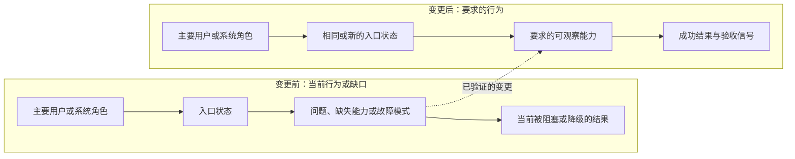
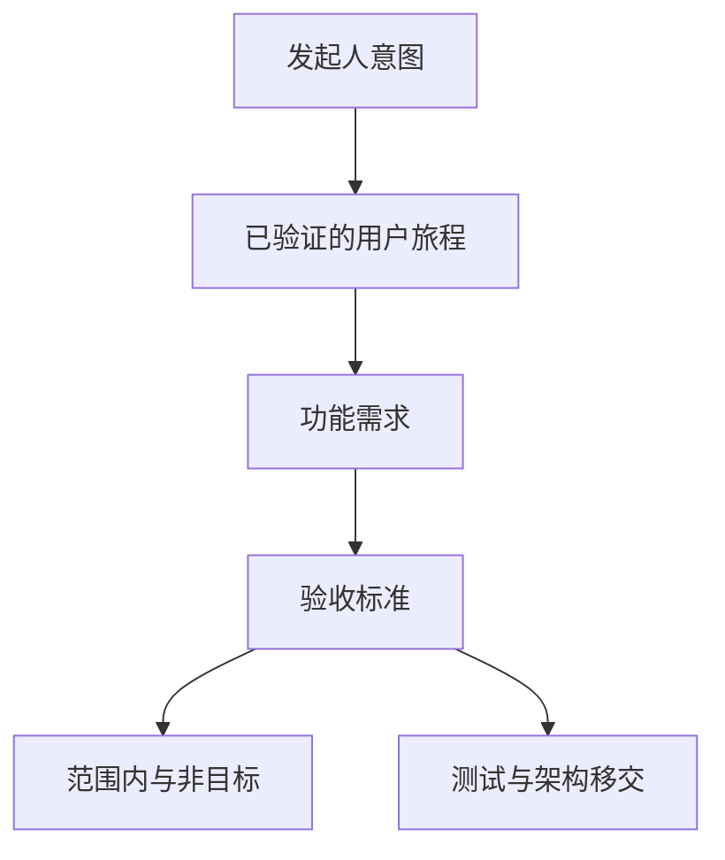

# 已验证需求：示例标题

## 发起人意图

- 产品层面的意图；保留发起人的重要原始措辞。

## 问题

- 当前的用户或系统问题，不预设实现方式。

## 目标用户

- 主要用户或系统角色，以及待完成的工作。

## 用户旅程

### UJ-1: 示例旅程

- 角色与场景：
- 入口状态：
- 路径：
- 成功条件：
- 边界情况：

## 术语表

- **术语** - 在下游一致使用的定义。

## 功能需求

### FR-1: 能力名称

系统必须提供可观察的能力。

验收标准：

- AC-1: 可观察条件。

来源：发起人请求或来源制品。

## 非目标

- 明确排除的行为或范围。

## MVP 范围

- 范围内：
- 范围外：

## 约束

- 发起人提供的约束。

## 成功标准

- 证明需求已满足的条件。

## 假设

- 需要在下游确认或验证的假设。

## 开放问题

- Q-1: 如果没有，写"无"。

## 移交给测试规划者

- 必须证明的行为：
- 需要 E2E 覆盖的用户旅程：
- 需要显式测试的风险领域：

## 移交给解决方案架构师

- 必须保留的产品约束：
- 架构必须承接的术语和边界：
- 需求引发的技术问题：

## Mermaid 验证

- 包含哪些图表及原因：
- 声明已检查：
- 任务特定标签已检查：
- 示例占位符已替换：
- 旅程/范围/状态标签描述可观察行为：
- 边语法已检查：
- 人类可读性已检查：
