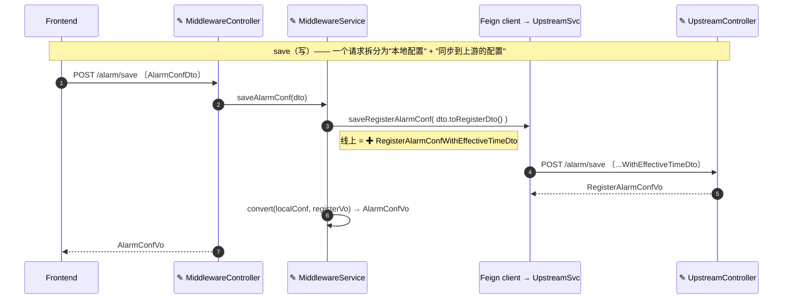

# 图表（mermaid）使用与验证

## 选择类型

让图表类型匹配它必须回答的问题：

- `flowchart` —— 控制流 / 数据流、决策分支；系统级架构概览使用 `flowchart` + `subgraph` 分组以反映真实分层。
- `sequenceDiagram` —— 调用者与服务随时间的交互，加上错误与鉴权分支。
- `classDiagram` —— 对象/类型之间的关系。
- `stateDiagram-v2` —— 有状态行为、状态损坏缺陷。
- `erDiagram` —— 存储与表结构、数据模型。

## 每张图表必须携带信息

图表必须携带信息、可审查、对人类易读——它不是装饰：使用真实组件与边界；让节点标签说明"这一步做什么、它保护什么"，而不是只给一个裸名词；概览中使用 `subgraph` 反映真实分层；对齐成对 before/after 图表的节点，让变更一目了然。"一张图表回答一个问题"意味着**不要超载一张图**——当一张图同时展示结构 AND 流程 AND 错误分支时，拆分*它*。这**不**意味着每个段落画一张图：一堵小流程图墙每张只是重复一个列表，比两三张各自回答一个难题的图更难审查。添加图表之前，先问它是否回答了现有图表和文字没有回答的东西；如果不能，把它折叠进文字或表格。

## 绘制变更

大多数设计工作是对现有代码的变更，而不是绿地系统。两种失败模式：(a) 重绘整个系统把变更埋没了；(b) 一堆几乎相同的按主题流程图。优先选择：

- **一张带变更标记的"after"图。** 标记新增/变更节点（例如 `✚` 新增、`✎` 变更），让审查者从一张图中读出增量。仅在变更重新布线现有结构（移动/移除/重指向）时使用真正的 before/after 对，对齐节点让差异可读。
- **数据跨越服务时的数据流序列。** 参与方是真实类，消息是真实函数，标签是线上呈现的 payload 类型（DTO/VO/entity）——同时包括写路径与读路径。这回答"哪个类/函数移动数据，以什么形状"，这是方框箭头图无法回答的。

示例——一个增量、跨服务变更（告警配置增加"生效时间"字段；`✚` 新增、`✎` 变更）。一张图覆盖变更切片；读路径以同样方式绘制。

## 语法验证

撰写包含 Mermaid 的产出后，在交付前对每张 fence 进行验证，使用与目标预览/发布环境兼容的 Mermaid 版本；如果你不知道版本，优先使用保守语法（例如 `graph TD`，选择兼容旧解析器的图表语法）。

- **有工具**：将每张 fence 提取到临时 `.mmd` 文件并运行 `mmdc -i <fence>.mmd -o <tmp>.svg`；非零退出码 = 该 fence 解析失败。当本地缺少 `mmdc` 且环境允许时，用 `npm install -g @mermaid-js/mermaid-cli` 安装；如果目标环境运行较旧版本，也可以临时安装匹配版本 `mermaid@<version>` 并用 `mermaid.parse` 解析每张代码 fence。
- **无工具**：如果无法安装 `mmdc`（无网络、无 npm、无全局安装权限），不要阻塞交付，也不要声称你未运行的验证：回退到保守语法（`graph TD`，不使用新解析器特性），逐张 eye-check 括号/引号平衡与箭头有效，并在交付备注中报告 `validation skipped: tooling unavailable`。

保留正式产出的源文档，并在交付备注中报告验证结果——或声明的跳过。
