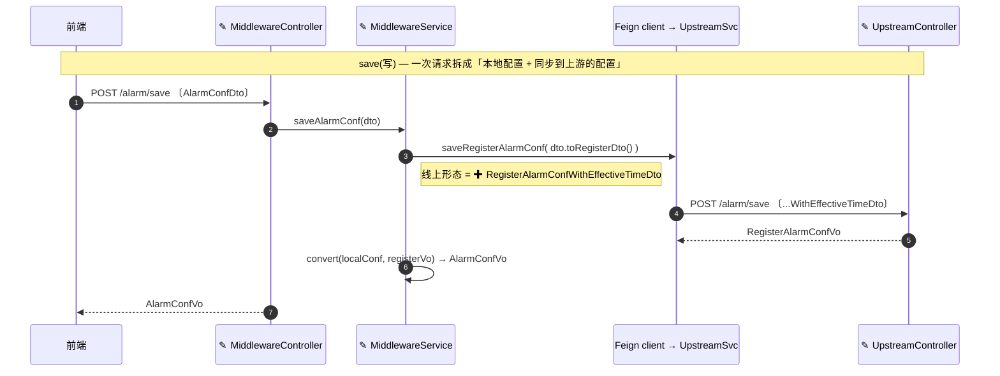

# Diagram (mermaid) 使用与校验

## 选择图表类型

根据图表需要回答的问题来选择类型：

- `flowchart` — 控制流 / 数据流、决策分支；做系统级架构总览时，用 `flowchart` + `subgraph` 分组来体现真实的分层。
- `sequenceDiagram` — 调用方与服务之间的时序交互，以及 error 和 auth 分支。
- `classDiagram` — 对象 / 类型之间的关系。
- `stateDiagram-v2` — 有状态行为、state-corruption 类缺陷。
- `erDiagram` — 存储与表结构、数据模型。

## 每张图都必须承载信息

图表必须承载信息、可供 review、对人易读——它不是装饰：使用真实的组件和边界；让节点标签说明"这一步做什么、保护什么"，而不是光秃秃一个名词；总览里用 `subgraph` 体现真实分层；成对的 before/after 图要对齐节点，让人一眼看出变化。"一张图回答一个问题"是指**别把单张图塞爆**——当一张图同时画结构+流程+错误分支时，拆**那一张**；它**不是**每段画一张的许可证：一堆各自复述一个清单的小流程图，比两三张各回答一个不同难题的图更难 review。加图前先问它是否回答了现有图+文字答不了的问题；否则并进文字或表格。

## 画变更（change diagram）

设计工作大多是对存量代码的改动，而非全新系统。两个坑：(a) 把整个系统重画一遍、把改动埋没；(b) 一堆几乎一样的、按话题拆的小流程图。优先：

- **一张标注了改动的"改后图"。** 标出新增/改动节点（如 `✚` 新增、`✎` 改动），让 reviewer 从一张图读出 delta。只有当变更**重塑**了既有结构（移动/删除/改接线）时，才用对齐节点的前后对比图。
- **数据跨服务流动时画数据流时序图。** participant 是真实的类，消息是真实的 function，标签带上线上 payload 形态（DTO/VO/entity），写路径和读路径都画。这回答"哪个类/哪个 function 搬运数据、以什么形态"——盒箭头图给不了。

示例 —— 一个纯增量的跨服务改动（告警配置新增"生效时间"字段；`✚` 新增、`✎` 改动）。一张图覆盖改动的切片，读路径同样画法。

## 语法校验

写完包含 Mermaid 的 artifact 后，交付前逐段校验每个代码块，针对目标预览/发布环境兼容的 Mermaid 版本进行；不知道版本号时，优先用保守语法（如 `graph TD`，选老解析器也能兼容的图表语法）。

- **有工具时**：把每个代码块抽取到临时 `.mmd` 文件，运行 `mmdc -i <fence>.mmd -o <tmp>.svg`；非零退出 = 该代码块解析失败。本地没有 `mmdc` 且环境允许时，用 `npm install -g @mermaid-js/mermaid-cli` 安装；如果目标环境跑的是旧版本，也可以临时安装对应 `mermaid@<version>`，然后用 `mermaid.parse` 逐段解析代码块。
- **没有工具时**：如果 `mmdc` 装不上（没网络、没 npm、没有全局安装权限），不要因此阻塞交付，也绝不声称一次你没跑过的校验：退回保守语法（`graph TD`，不用新解析器特性），逐段人工复查括号/引号是否配对、箭头是否合法，并在 delivery note 里报告 `validation skipped: tooling unavailable`。

正式 artifact 保留源文件，校验结果——或声明的跳过——写到 delivery note 里。
