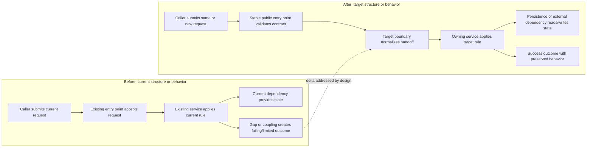
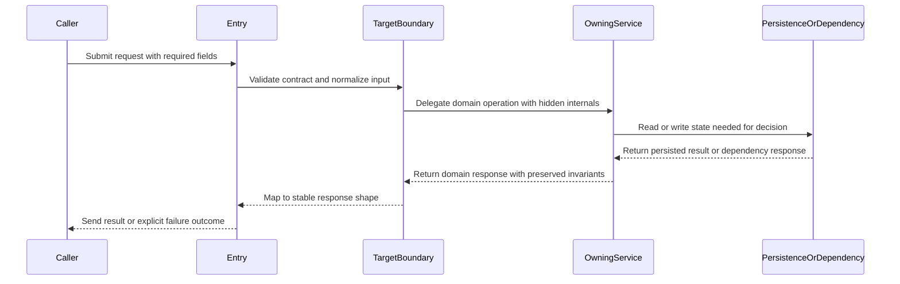

# Design Artifact

## Design Intent

## Source References

## Current Context

## Components Or Affected Modules

- Component ownership, boundary, and hidden internal detail.

## Interfaces And Contracts

## Data Or State Flow

## Mermaid Validation

- Block count:
- Before/after required:
- Declarations checked:
- Task-specific labels checked:
- Example placeholders replaced:
- Step labels explain action/output/boundary:
- Edge syntax checked:
- Rendered diagram assets:

## Existing Behavior To Preserve

## Technical Approach

## Complexity

## Risks

## Verification-Relevant Notes

## Implementation Constraints

## Specialist Reviews Recommended

## Open Questions

## Handoff To Implementation Planner
