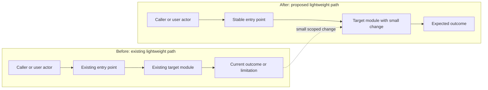
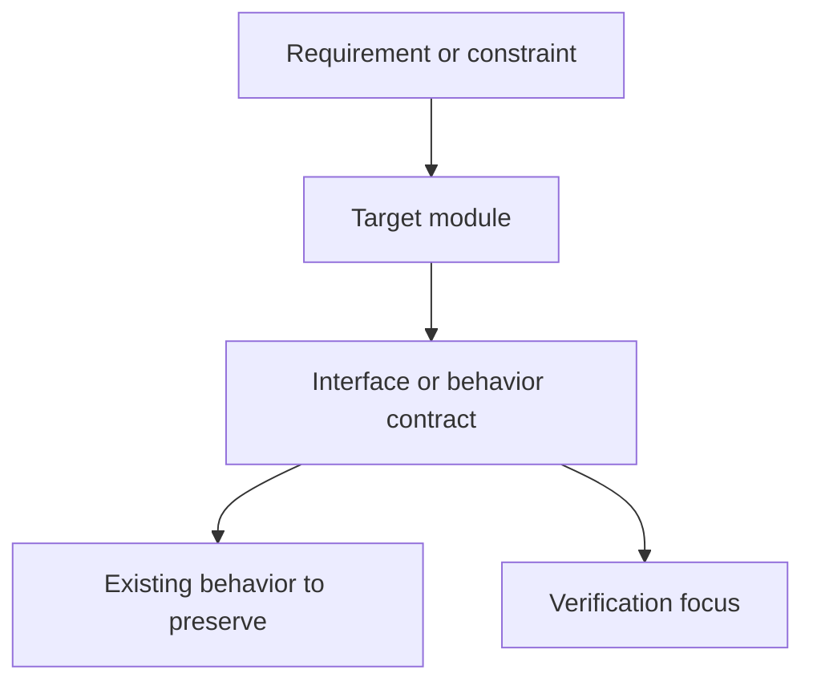

# Lightweight Design Note: Example Title

## Design Intent

## Existing Context

## Target Modules

## Interfaces And Contracts

## Existing Behavior To Preserve

## Proposed Approach

## Mermaid Validation

- Block count:
- Before/after required:
- Declarations checked:
- Task-specific labels checked:
- Example placeholders replaced:
- Edge syntax checked:
- Rendered diagram assets:

## Risks

## TestPlan Mapping

## Implementation Constraints

## Handoff To Implementation Planner
