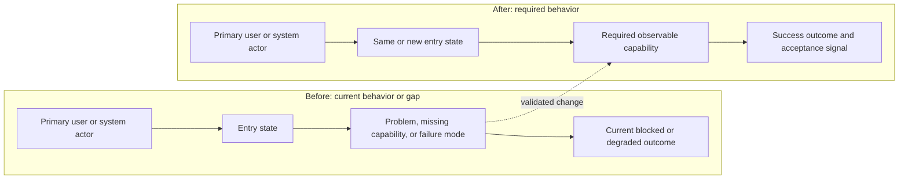
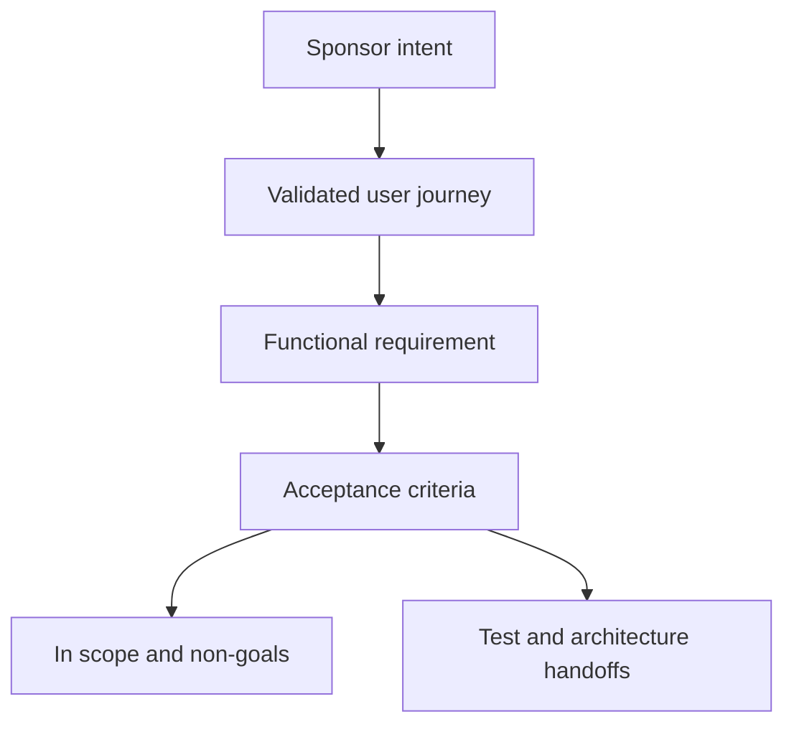

# Validated Requirements: Example Title

## Sponsor Intent

- Product-level intent, preserving important sponsor wording.

## Problem

- Current user or system problem without prescribing implementation.

## Target Users

- Primary user or system actor and job to be done.

## User Journeys

### UJ-1: Example journey

- Persona and context:
- Entry state:
- Path:
- Success condition:
- Edge case:

## Glossary

- **Term** - Definition used consistently downstream.

## Functional Requirements

### FR-1: Capability name

The system must provide an observable capability.

Acceptance criteria:

- AC-1: Observable condition.

Source: sponsor request or source artifact.

## Non-Goals

- Explicit excluded behavior or scope.

## MVP Scope

- In scope:
- Out of scope:

## Constraints

- Sponsor-provided constraint.

## Success Criteria

- What proves the requirements are satisfied.

## Assumptions

- Assumption requiring confirmation or downstream validation.

## Open Questions

- Q-1: Empty when none.

## Handoff To Test Planner

- Must-have behaviors to prove:
- User journeys requiring E2E coverage:
- Risk areas needing explicit tests:

## Handoff To Solution Architect

- Product constraints to preserve:
- Terms and boundaries that architecture must use:
- Technical questions raised by the requirements:

## Mermaid Validation

- Block count:
- Before/after required:
- Declarations checked:
- Task-specific labels checked:
- Example placeholders replaced:
- Edge syntax checked:
- Rendered diagram assets:
