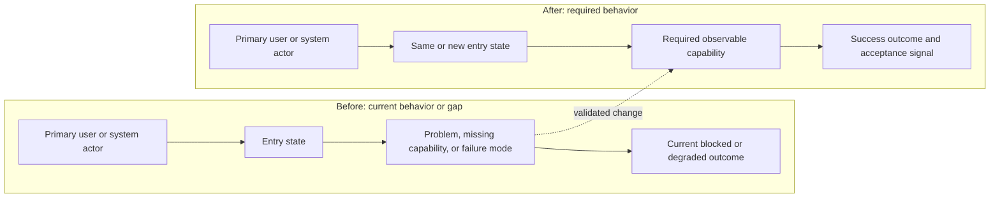
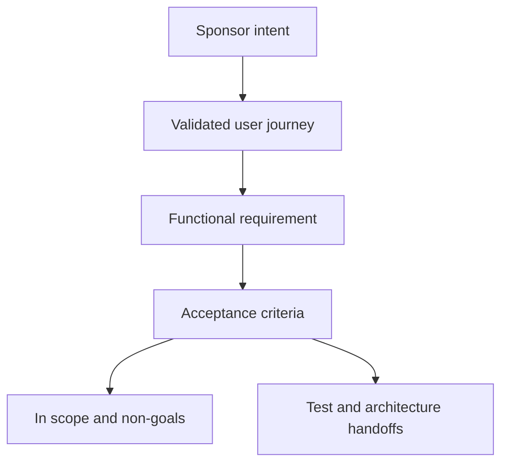

# 已验证需求：Example Title

## 发起人意图

- 产品层面的意图，保留重要的 sponsor wording。

## 问题

- 当前用户或系统问题，不预设实现。

## 目标用户

- 主要用户或系统 actor，以及要完成的 job。

## 用户旅程

### UJ-1: Example journey

- Persona 与上下文:
- 进入状态:
- 路径:
- 成功条件:
- 边界情况:

## 术语表

- **术语** - 下游一致使用的定义。

## 功能需求

### FR-1：能力名称

系统必须提供可观察的能力。

验收标准:

- AC-1：可观察条件。

来源：sponsor request 或 source artifact。

## 非目标

- 明确排除的行为或范围。

## MVP 范围

- 范围内:
- 范围外:

## 约束

- Sponsor 提供的约束。

## 成功标准

- 证明需求已满足的条件。

## 假设

- 需要确认或下游验证的假设。

## 开放问题

- Q-1：没有时写“无”。

## 交给 Test Planner 的交接

- 必须证明的行为:
- 需要 E2E 覆盖的用户旅程:
- 需要显式测试的风险区域:

## 交给 Solution Architect 的交接

- 必须保留的产品约束:
- 架构必须沿用的术语和边界:
- 需求提出的技术问题:

## Mermaid 校验

- 已包含哪些图以及原因:
- 声明已检查:
- 任务特定标签已检查:
- 示例占位已替换:
- journey/scope/state 标签说明了可观察行为:
- Edge 语法已检查:
- 人类可读性已检查:
