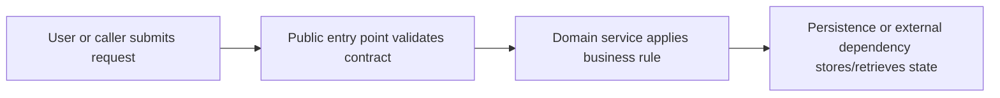
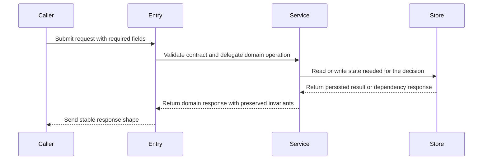

# Phase: Architecture Design

## Purpose
Design the system structure before any implementation. Architecture docs prevent expensive rework by making structural decisions explicit before code is written.

## Design Framing

Complexity is the enemy of maintainable software. Every design decision should minimize:

- **Change amplification** — A simple change requires edits in many places. Good design localizes change: one decision, one place.
- **Cognitive load** — A developer must hold too much context to work safely. Deep modules hide complexity behind simple interfaces so callers need to know as little as possible.
- **Unknown unknowns** — It is not obvious what must change or what a developer needs to know. This is the worst symptom. Good design makes dependencies visible and contracts explicit.

**Design mindset:** Pull complexity down into modules — don't push it to callers. The right interface is the simplest one that lets callers accomplish their goals without knowing how. Make the right structural decisions before writing implementation details.

"Design it right the first time" — not because redesign is impossible, but because structural mistakes compound. Every new caller written against a leaky interface is one more place to fix later.

## Process

### Step 1 — Design Skeleton

1. **Identify modules and responsibilities** — What are the key components? What does each own? What is each module's one job?
2. **Define interfaces** — What is the minimal interface each module exposes? What does it hide? Apply the principle: interfaces should be simple, implementations can be complex.
3. **Use relevant principle files** — Load only the principle files needed for the current design risk, then validate the skeleton against those dimensions: Are modules deep? Is information hidden? Are layers clean? Is coupling minimized?
4. **Document the skeleton** — Describe modules, interfaces, type signatures, and module structure in the design artifact. Explain key design choices: what is hidden, why it is hidden, and what each interface encodes.

### Step 2 — Architecture Document

Write the architecture document to the assignment's `output_path`, normally `design/architecture.md`.

This is a design decision artifact. Keep it focused on the structural choices Implementation Planner must rely on.

**Required sections:**
1. Problem statement (one paragraph)
2. Design intent and key decisions
3. Component breakdown: what each piece owns and hides
4. Interfaces/contracts that must stay stable
5. Data flow or state flow when it affects boundaries
6. Technology choices + rationale when not obvious
7. Complexity estimate: S (hours) / M (day) / L (days) / XL (week+)
8. Architecture diagrams:
   - Change-bearing work (enhancement/delta, bugfix/fix, redesign, interface/data-flow/behavior change): at least two complete Mermaid diagrams, with at least one explicit before/after diagram.
   - No-change architecture records: at least one complete Mermaid diagram.
   - These counts are lower bounds. Add more diagrams only when multiple views are useful. Mermaid must be readable in Markdown without relying on generated HTML, SVG, PNG, or screenshots: keep each diagram focused on one question, target at most 8 nodes for flowcharts or 6 participants and 12 messages for sequence diagrams, and split any diagram that exceeds that budget.
   - Every diagram must be inspectable, not decorative: include real affected components/modules, boundaries, interfaces, data/state flow, decision points, preserved paths, and success/failure outcomes where relevant. Each step should say what happens there, what is produced/validated/handed off, or what boundary is protected; function or class names alone are not enough. Do not use rough placeholder diagrams such as `User --> System --> DB`.
9. Complexity analysis:
   - Identify potential sources of complexity (dependencies, obscurity)
   - How the design minimizes change amplification
   - How the design reduces cognitive load
   - How the design avoids unknown unknowns
10. Risks and implementation constraints

Architecture is the primary user-facing design artifact after requirements. It may be more concrete than other artifacts, but it should stay proportionate: explain the architecture once, then let diagrams and short notes carry the detail without repeating paragraphs. Mermaid diagrams are mandatory, not optional. Choose the diagram type that best explains the design: `flowchart` for control/data flow and decision branches, `sequenceDiagram` for caller/service interactions over time, class/UML-style Mermaid diagrams for object/type relationships, and state diagrams for stateful behavior. Direct vertical flow is fine when it is the clearest view, but node labels must describe each step's role rather than only naming functions.

Before completing the document, validate the fenced Mermaid blocks by parsing or rendering them with `mmdc`/Mermaid tooling when available; otherwise record manual validation evidence in the artifact or handoff. Do not generate separate rendered files unless the sponsor explicitly asks for them. Manual validation must at least confirm the block count, before/after presence when required, supported diagram declarations such as `flowchart TD`, `flowchart LR`, `sequenceDiagram`, `classDiagram`, or `stateDiagram-v2`, simple node IDs, quoted labels that contain punctuation, task-specific labels instead of generic examples, replacement of template placeholders, edges that reference existing or intentionally introduced nodes, and human readability within the size budget. Use examples when they resolve ambiguity. Cite the TestPlan for verification detail.

Example component view:



Example request or data flow:



### Step 3 — Validate Design

For each module, check against the principle checklist:
- Does it leak internal details?
- Does it push complexity to callers?
- Are names precise and consistent?
- Are layers providing distinct abstractions?

## Output Format

Start with a **Design Intent** block: 3-5 bullets covering the key modules, their interfaces, and major hiding decisions. Then output the architecture document.

**Design Intent format:**
```
## Design Intent

- [Module/component]: [what it owns and what its interface hides]
- [Key interface decision]: [why this shape, what caller is spared knowing]
- [Major hiding decision]: [what implementation detail is buried and why]
```

For **redesigns**: after the Design Intent block, include a brief **What Changed** note listing the specific design issues found in the original and how the redesign addresses each one.

**Key rules:**
- Language-agnostic output — match the language of the input file if redesigning, or use the most natural language for the description
- Do not write implementation files. Contract examples in this document are illustrative design content only.
- If the description or existing code is too vague to design confidently, return `blocked` with the specific question or missing evidence.

## Principles

All principle files inform architecture decisions:

- `principles/module-depth.md` — Deep vs shallow modules, interface simplicity, over-decomposition
- `principles/information-hiding.md` — Encapsulation, information leakage, temporal decomposition
- `principles/abstraction-layers.md` — Layer separation, pass-through methods, complexity placement
- `principles/cohesion-separation.md` — Together-or-apart decisions, code repetition, general-special mixing
- `principles/error-handling.md` — Exception proliferation, defining errors out of existence
- `principles/naming-obviousness.md` — Name precision, code clarity, consistency
- `principles/documentation.md` — Comment quality, abstraction documentation
- `principles/strategic-design.md` — Tactical vs strategic thinking, modification quality

## Outputs
- Markdown architecture document at the assigned `output_path`.

## Quality Gate
- Architecture doc contains all required sections
- Design Intent block is present with 3-5 bullets
- Mermaid coverage matches the work type: change-bearing work has at least two complete diagrams including one before/after view; no-change architecture records have at least one complete diagram; additional or split diagrams are used when they improve readability
- Mermaid diagram types fit the design question, and each step explains what happens or what is handed off instead of relying on function/class names alone
- Mermaid validation evidence is recorded, either tool-based or manual, including the human-readability check
- Complexity analysis addresses change amplification, cognitive load, and unknown unknowns
- Modules pass principle checklist validation

## Skip Conditions
Runs for greenfield systems (`dev/architecture-first`), major redesigns, or enhancement work where structural decisions dominate. Pair with `impact-analysis` only when the assignment explicitly asks for both. Bugfixes use `diagnose`; small additions use `lightweight-design-note`.
