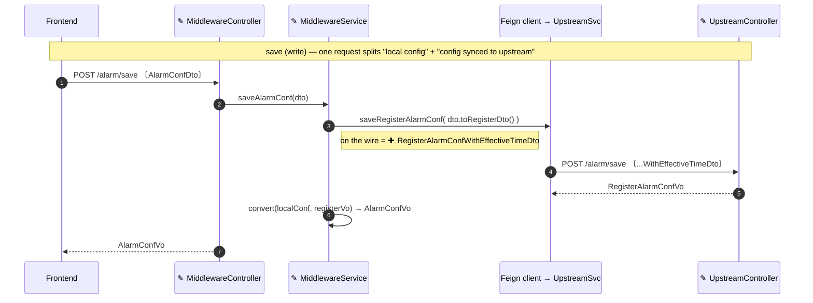

# Diagram (mermaid) usage and validation

## Choosing a type

Fit the diagram type to the question it must answer:

- `flowchart` — control flow / data flow, decision branches; for the system-wide architecture overview, use `flowchart` + `subgraph` grouping to reflect the real layering.
- `sequenceDiagram` — interactions between a caller and services over time, plus error and auth branches.
- `classDiagram` — relationships between objects/types.
- `stateDiagram-v2` — stateful behavior, state-corruption defects.
- `erDiagram` — storage and table structure, data models.

## Every diagram must carry information

A diagram must carry information, be reviewable, and read easily for a human — it is not decoration: use real components and boundaries; let node labels state "what this step does, what it protects" rather than just a bare noun; use `subgraph` in the overview to reflect the real layering; align the nodes of paired before/after diagrams so the change reads at a glance. "One diagram answers one question" means **don't overload one diagram** — when a single diagram is showing structure AND flow AND error branches at once, split *that one*. It does **not** mean draw one diagram per paragraph: a wall of small flowcharts that each restate a list is harder to review than two or three that each answer a distinct, hard question. Before adding a diagram, ask whether it answers something the existing diagrams and prose don't; if not, fold it into prose or a table.

## Diagramming a change

Most design work is a change to existing code, not a greenfield system. Two failure modes: (a) redrawing the whole system so the change is buried; (b) a pile of near-identical per-topic flowcharts. Prefer:

- **One "after" diagram with the change marked.** Mark added/changed nodes (e.g. `✚` added, `✎` changed) so a reviewer reads the delta from one picture. Use a true before/after pair only when the change re-wires existing structure (moves/removes/re-points), where aligned nodes make the difference legible.
- **A data-flow sequence when data crosses services.** Participants are the real classes, messages the real functions, labels the payload type as it appears on the wire (DTO/VO/entity) — for both the write and the read path. This answers "which class/function moves the data, and in what shape," which a box-and-arrow diagram cannot.

Example — an additive, cross-service change (alarm config gains an "effective time" field; `✚` new, `✎` changed). One diagram covers the slice that changed; the read path is drawn the same way.

## Syntax validation

After writing an artifact that contains Mermaid, validate every fence before delivery, against a Mermaid version compatible with the target previewer/publishing environment; if you don't know the version, prefer conservative syntax (e.g., `graph TD`, choosing diagram syntax compatible with older parsers).

- **With tooling**: extract each fence to a temp `.mmd` file and run `mmdc -i <fence>.mmd -o <tmp>.svg`; non-zero exit = the fence fails to parse. When `mmdc` is missing locally and the environment permits, install it with `npm install -g @mermaid-js/mermaid-cli`; if the target environment runs an older version, you can instead temporarily install the matching `mermaid@<version>` and parse each code fence with `mermaid.parse`.
- **Without tooling**: if `mmdc` cannot be installed (no network, no npm, no global-install permission), do not block delivery and do not claim a validation you did not run: fall back to conservative syntax (`graph TD`, no newer-parser features), re-check each fence by eye for balanced brackets/quotes and valid arrows, and report `validation skipped: tooling unavailable` in the delivery note.

Keep the source document for the formal artifact, and report the validation result — or the declared skip — in the delivery note.
